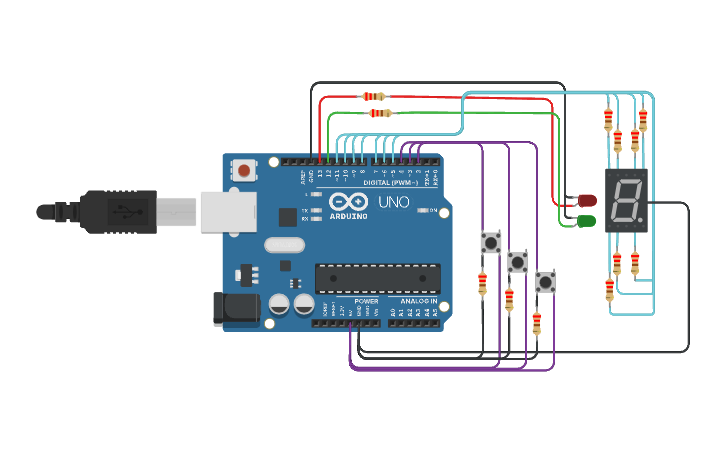

# Documentación 

## Alumno 

- OLIVETO GOÑI AGUSTÍN

---
## Proyecto: Modelo de montacarga funcional

---
## Descripción

Montacargas funcional de 9 pisos para un hospital, este cuenta con  tres botones, uno para subir, uno para bajar y el otro para detenerlo en el piso que se desee.

---
## Función principal
En el loop se pregunta si se encendio el boton para subir (botonSube) o se encendio el boton para bajar (botonBaja), si alguno de los dos se encendio entra en el If, ambos
siguen los mismos pasos pero uno sube y el otro baja, en el caso de que se precione el boton de subida entramos en el if y se ejecuta la primer funcion subirMontacargas()
que lo que hace es cambiar el estado de (montacargaEnFuncionamiento) de false a true, para que el montacargas funcione hasta que se oprima el boton de detener, luego la funcion encendido() prende el led verde y apaga el rojo y por ultimo se ejecuta la funcion pisoMontacarga() que dentro trae un contador y un switch con los pisos del 0 al 9 y dependiendo el numero del contador se ejecutara un case.
Mientras no se precione ningun boton, el montacargas se encuentra apagado, por lo que se ejecuta la funcion apagado() , esta lo que hace es encender el led rojo y apaga el verde.
Luego pregunta si se preciono el boton para detener el montacargas (botonStop), si se preciono entra en el If y se ejecuta la funcion detenerMontacargasSubiendo() , que lo que hace es
volver a cambiar el estado de la bandera de true a false.

---
~~~ C (lenguaje en el que esta escrito)
void loop()
{
  if(contadorPiso == 0)
  {
  	prendeCero();
  }
  if(montacargaEnFuncionamientoSubiendo == true || digitalRead(botonSube) == HIGH)
  {
    subirMontacargas();
    encendido();
    pisoMontacarga();
  }
   else
  {
    apagado();
  }
  if(digitalRead(botonStop) == HIGH)
  {
    detenerMontacargasSubiendo();
  }
  
  
  if(montacargaEnFuncionamientoBajando == true || digitalRead(botonBaja) == HIGH)
  { 
    bajarMontacargas();
    encendido();
    pisoMontacarga();
  }
  else
  {
    apagado();
  }
  if(digitalRead(botonStop) == HIGH)
  {
    detenerMontacargasBajando();
  }
   
}
~~~

---
## Link al proyecto

- [proyecto](https://www.tinkercad.com/things/2WKwxqE7K3B?sharecode=eJYGjR2M4bK_9IeDN85Z1CMlQcvg-5Tilxm0L725pzw)

- [GDB](https://onlinegdb.com/bnIlBmOJH)

---

